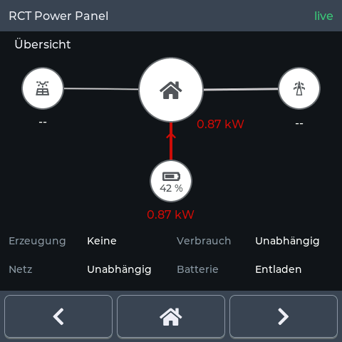

# rct-panel

> **Not affiliated with RCT Power GmbH.** Independent project, no connection to,
> endorsement by or support from RCT Power GmbH.

Energy panel for an **RCT Power** inverter, on a **Guition ESP32-S3 4848S040**
wall display (480 × 480, capacitive touch). Live values read over TCP, the
energy flow, 24 hours of history on an SD card, and a web interface in the local
network — in German or English, one per build.



- **Seven pages**, reached with the three buttons at the bottom: energy flow,
  daily/monthly/yearly totals, the 24 h graph, device information, the
  switching output, and the service page.
- **Live data** re-read from the device every 10 s: grid, household load, PV
  (two strings plus the S0 meter), battery power/current/voltage/SOC,
  temperatures, cycles, SOH, island mode and the device's lifetime counters.
- **24 h history** from an SD card: one row every five minutes, 288 points, and
  the chart is filled again after a restart. The CSV keeps the month, with the
  rows in plain text (23 columns, see `docs/sd-history.md`).
- **Web interface** at the panel's address: the same values, the CSV and the
  screenshots as downloads, firmware update over the air.
- **The switching output** (1-Way relay port) can follow grid draw, PV surplus,
  a fault word or island mode; it never runs on data older than ten minutes and
  says so (`docs/relay.md`).
- **The backlight** dims after three minutes without a touch and switches off
  after five.

## Build and flash

PlatformIO with `espressif32@6.8.0` (Arduino-ESP32 core 3.x), LVGL 9 and
WiFiManager as the only library dependencies. The board definition is in
`boards/`, the partition table in `partitions/`.

```sh
pio run -e esp32-s3 -t upload --upload-port /dev/ttyACM0
```

`/dev/ttyACM0` is the panel's own USB-C port; a USB-TTL adapter on the UART
pins appears as `/dev/ttyUSB0` and flashes just as well.

| Command | What it does |
|---|---|
| `pio run -e esp32-s3` | build the German firmware into `.pio/build/esp32-s3/` |
| `pio run -e esp32-s3 -t upload` | build and flash it (`--upload-port` if several boards are attached) |
| `pio run -e esp32-s3-en -t upload` | the English build instead |
| `pio run -e esp32-s3 -t erase` | erase the stored Wi-Fi and settings |
| `pio device monitor` | serial console, 115200 baud |
| `tools/run_host_tests.sh` | the host tests — no panel, no card, no inverter |

First boot: the panel has no network yet, so it serves the access point
**RCT-Panel**. Connect to it and open `http://192.168.4.1` to enter the Wi-Fi
credentials and the address of the RCT device (`rct_host`, `rct_port`,
default `192.168.0.1:8899`). Everything after that is in the panel's own web
interface; `docs/hardware.md` has the pin map, the boot log and the quirks of
the board.

## Documentation

| File | For whom |
|---|---|
| [`docs/benutzerhandbuch.pdf`](docs/benutzerhandbuch.pdf) | the installation: connection, pages, settings, CSV format, troubleshooting (German) |
| [`docs/hardware.md`](docs/hardware.md) | pin map, bring-up checklist, quirks, open questions |
| [`docs/relay.md`](docs/relay.md) | the switching output and the ten-minute data deadline |
| [`docs/sd-history.md`](docs/sd-history.md) | the CSV format and the SD logger |
| [`docs/energy-page.md`](docs/energy-page.md) | the totals page and its arithmetic |
| [`docs/web-interface.md`](docs/web-interface.md) | the web interface, its routes and its limits |

## License

MIT for the project code — see [`LICENSE`](LICENSE). The firmware links
LGPL-2.1-or-later (Arduino-ESP32 core) and Apache-2.0 (ESP-IDF) components, so
an image is distributed under those terms; every component and its license is
listed in [`NOTICE`](NOTICE).