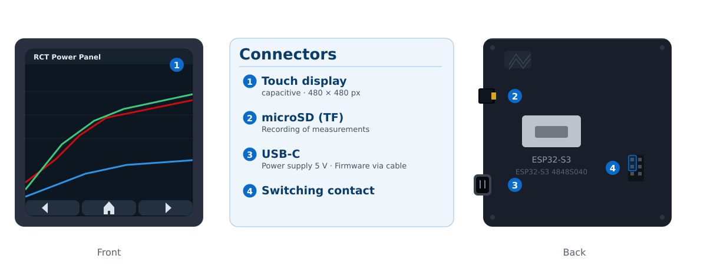
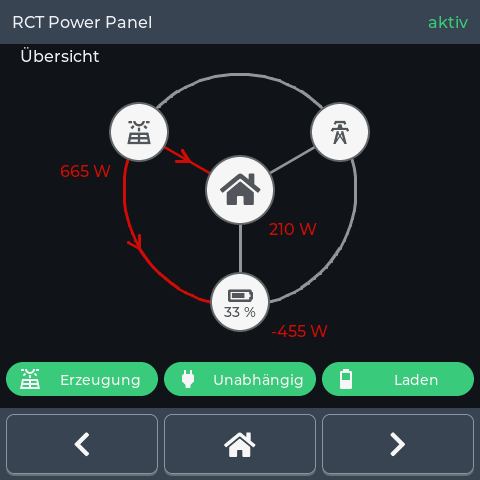
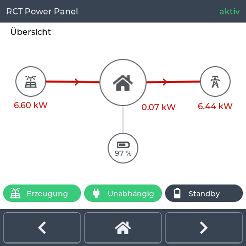
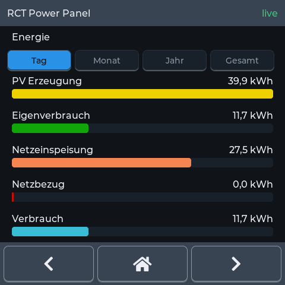
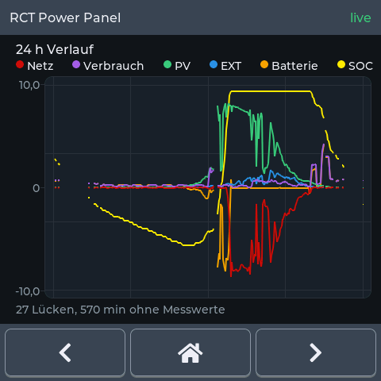
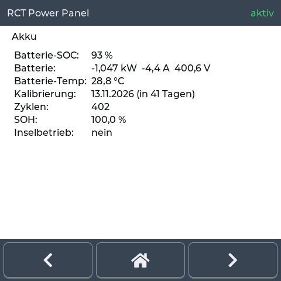
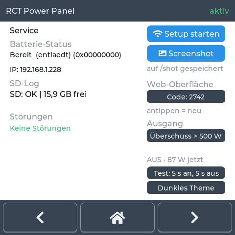
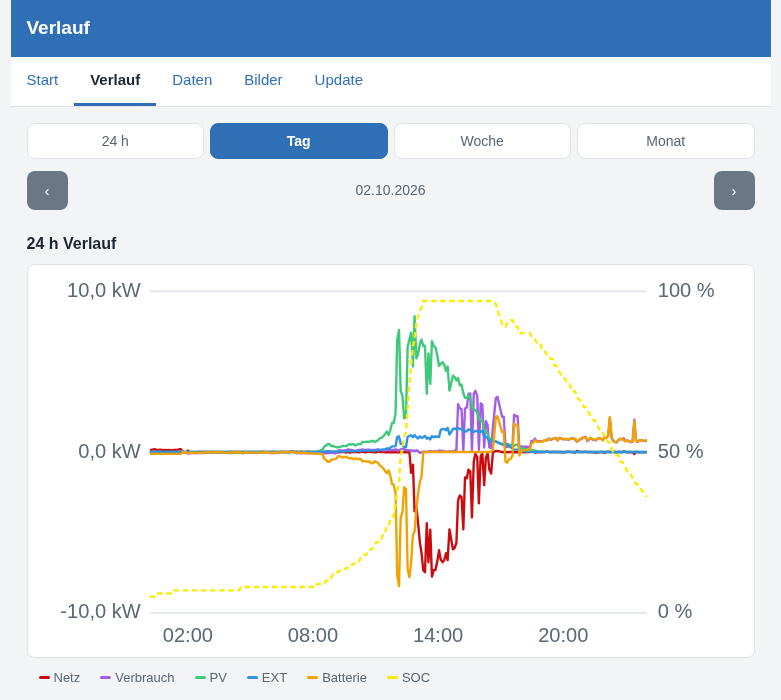

# RCT Power Panel <span class="h-sub">User Manual</span>

> **No affiliation with RCT Power GmbH.** Independent project, neither endorsed
> nor supported by them.

The RCT Power Panel is a wall-mounted panel that displays the live data of your
inverter. It reads the values directly from the inverter (RCT or
OpenInverterGateway, TCP, standard port 8899), displays them on seven pages and
writes them to a microSD card every five minutes — so the measurements are
retained even when the panel is switched off.

<figure class="ports-shot">
  
  <figcaption>Figure 1: Front and back</figcaption>
</figure>

---

## Quick Start <span class="h-sub">Commissioning in 5 Steps</span>

> **First installation:** A new board has no firmware yet. Flash it once in the
> browser: <https://fboor.github.io/rct-panel/install/> — connect USB cable,
> Chrome, Edge or Firefox, select device, done.

You only need two pieces of information, nothing else:

1. the name and password of your Wi-Fi network,
2. the IP address of your inverter — the device occasionally shows it
   directly on its display.

The port is uniformly `8899` and already preset — there is nothing to enter.

Here's how:

1. Connect the panel — USB-C cable to a power supply, the display immediately
   shows the overview.
2. Select Wi-Fi "RCT-Panel" — the panel creates this access point on first
   start (or when no saved network is reachable).
3. Open the portal — call `http://192.168.4.1` in the browser. Most browsers
   detect the device via captive portal detection.
4. Fill in two fields and save — Wi-Fi name/password as well as the IP
   address of the inverter (the port is already preset).
5. Done. The panel connects to your Wi-Fi and shows the live data. The access
   point "RCT-Panel" disappears automatically.

What it looks like afterwards: At the top the status bar with the connection
status (`active`, green = all good), in the middle the current page; at the
bottom ◀ / ▶ scroll through the seven pages, ⌂ jumps to the overview. Details
about the pages are in Chapter 3, setup from Chapter 1.

In the browser on your home network, you will find under `http://<IP of the panel>/settings`
device type, address, port and theme — you can change the device later there
without reconfiguring Wi-Fi (Chapter 1.4). The IP address of the panel is at
the top left of the Service page, see Section 3.7.

The measurements are also on the SD card and can be retrieved later in the
browser: IP address and code for this are on the Service page,
see Chapter 5. There you will also find the energy bars and the history — the
browser draws the diagrams, the panel only provides the numbers.

---

## 1. Commissioning

### 1.1 Connectors

All connectors are located on the side edges and are accessible from the side —
the panel does not need to be removed from the wall. The numbers in Figure 1 and
Figure 2 belong together; "left" and "right" refer to the rear view.

| No. | Connector | Position | Use |
|---|---|---|---|
| 1 | Touch display | Front | Display and operation |
| 2 | microSD (TF) | Left edge, top | Recording of measurements (Chapter 4) |
| 3 | USB-C | Left edge, bottom | Power supply 5 V, firmware update via cable (Chapter 10) |
| 4 | Switching contact | Pin header H1, right edge | GND and 3.3 V switching output for an external relay (Chapter 6) |

<figure class="board-shot">
  
  <figcaption>Figure 2: Back of the board with all connectors in place. Grey: not used by the firmware.</figcaption>
</figure>

The switching contact is located at pin header H1 on the right edge and has two
connectors: in the left row the two upper pins, at the top the label GND,
below it the 3.3 V switching output, to which the coil of an external relay
connects — more on this in Chapter 6. Only the 5 V of the USB power supply
and these 3.3 V are present on the panel itself; mains voltage must not be
connected to any connector.

### 1.2 First Power-On

1. Supply the panel with 5 V. The display starts immediately.
2. Without a saved Wi-Fi network, the panel starts its own Wi-Fi access point
   (AP) with the name `RCT-Panel` — even if no network is reachable.
3. Connect to this Wi-Fi with a smartphone/laptop and open the configuration
   page at `http://192.168.4.1`. Most browsers detect the device via captive
   portal detection.

### 1.3 Configuration in the Setup Portal

Enter the following in the portal:

| Field | Meaning | Default |
|---|---|---|
| Wi-Fi name / password | Your home network | — |
| `device_host` | IP address or hostname of the inverter | `192.168.0.1` |
| `device_port` | TCP port for the inverter protocol | `8899` |

Confirm the form. The panel saves the data permanently (NVS) and then switches
to the configured network — the access point `RCT-Panel` disappears as
expected.

> **Tip:** The access point remains active until the panel is successfully
> configured. If the password is wrong or the network is unreachable, the
> portal opens automatically so you can correct the data.

<figure class="portal-shot">
  
  <figcaption>Figure 3: Configuration portal at http://192.168.4.1 with the fields for Wi-Fi and RCT address</figcaption>
</figure>

### 1.4 Reconfiguring Later

**On the home network** — on the `/settings` page in the browser:

| Field | Meaning |
|---|---|
| Device | Inverter **RCT** or **OpenInverterGateway** |
| Address | IP address or hostname of the device |
| Port | TCP port on which the device responds (`8899` for both) |
| Theme | dark or light |

Below that are the **switching output** (threshold in watts, test) and
**maintenance** (restart, reset Wi-Fi). Details in the chapter on the
switching output.

*Save* writes the data to NVS memory and restarts the panel — without access
point, without Wi-Fi password. After the switch, the overview adapts to the
device: an *OpenInverterGateway* without a house meter shows a PV node instead
of the house.

**In an emergency** — if the panel is not on the home network at all:

- Open the "Start setup" button on the Service page — the panel then starts
  the configuration access point again.
- Or start the panel while no saved network is reachable (the AP appears
  automatically after about 15 s).
- To reset to factory defaults, the NVS memory can be erased (developer
  guide, Section 10).

---

## 2. Operation

Operation is via touch:

- ◀ / ▶ (left/right button at the bottom): one page back or forward.
- ⌂ (home center): jumps to the overview.
- The order of the pages is fixed: Overview → Energy → Today →
  24 h History → Info → Battery → Service (and back again).

Status bar (top): on the left "RCT Power Panel", on the right the connection
status:

| Badge | Meaning |
|---|---|
| `active` (green) | Inverter connected, data current |
| `connecting` (yellow) | Wi-Fi and connection are being established |
| `no data` (red) | Wi-Fi is up, but no RCT data is arriving |
| `reconnect` (yellow) | Data was coming, the data stream broke — restarting the connection |
| `waiting` (yellow) | Connection is up, but no new value for over a minute — the displayed numbers are the last received |

`waiting` is not an error: Some inverters deliver nothing for minutes, and the
switching output continues to operate. "–" instead of a value means: not yet
received — the panel does not show an invented zero value.

### Light or Dark Theme

The default is the dark theme. At the bottom right of the Service page is
"Light Theme", tapping again "Dark Theme". The selection is retained, a
restart is not necessary. Cards, diagram, rows, buttons and the colored texts
look the same in both themes.

### Power Saving Mode

Without operation, the light turns off automatically:

| Time without operation | Display |
|---|---|
| up to 3 minutes | full brightness |
| from 3 minutes | dimmed to 30 % |
| from 5 minutes | light off |
| first touch | immediately bright again, the times start over |

The panel does not brighten up again by itself. The times are fixed. Without a
recognized touchscreen, the light stays on permanently.

---

## 3. The Functions in Detail

### 3.1 Overview

The flow diagram shows the current measurement data.

| Node | Position | Value |
|---|---|---|
| PV generation | left, if there is a house meter, otherwise in the middle | Generation from solar generator A and B, plus an external S0 meter, if present |
| House | Middle | Current consumption, only with house meter |
| Grid | Right | Draw or feed-in (negative = feed-in), only with meter |
| Battery | Bottom | State of charge in percent in the node, power below, only with battery |

If meters and battery are missing, one node remains: the PV in the middle,
large, with its value below and a single field.

With RCT Power, the inverter already deducts the external feed-in from its load
measurement; the panel adds the S0 value back so that the actual house
consumption is shown here.

The values under the nodes are in whole watts below 1 kW ("380 W") and in kW
with two decimal places above ("1.23 kW").

The arrows glow red in the direction of the current energy flow, but only where
there is a connection. Below that are as many fields as the device reports
(symbol, text and color), each showing one of three states:

| Field | green | orange | grey |
|---|---|---|---|
| Generation (sun with panel) | covers house consumption | does not cover it | below 20 W: "Inactive" |
| Consumption (plug) | Independent (no grid draw) | Grid draw | below 10 W: "Consumption" in grey |
| Battery (half-full battery) | Charging | Discharging | no current (no field if the device has no battery at all) |

Grid draw and generation count from 20 W; below that the sign is noise, and the
field shows "Inactive". The dash is reserved for values that the inverter has
not yet reported. For "Generation", the same house consumption applies as in
the diagram, i.e. with the S0 meter: a house supplied by S0 therefore does not
appear orange.

<figure class="display-shot">
  
  
  <figcaption>Figure 4: The overview, left in dark and right in light theme. The change affects the page background and the labeling on it; the fields at the bottom and the nodes retain their colors.</figcaption>
</figure>

### 3.2 Energy

Accumulated energies as bars — selectable via the buttons
Day | Month | Year | Total:

| Bar | Color | Explanation |
|---|---|---|
| PV generation | yellow | generated energy |
| Self-consumption | green | taken by the house, what did not come from the grid (= consumption − grid draw, never negative) |
| Grid feed-in | orange | fed-in energy |
| Grid draw | red | energy drawn from the grid |
| Consumption | turquoise | total consumption |

The bars are normalized to the largest value of the selected period; the values
are right-aligned above the respective bar (kWh or MWh with decimal comma).
They do not add up: The difference between PV generation and the sum of
self-consumption and grid feed-in is what is in the battery and what the
conversion costs. Self-consumption counts during discharge, not during
charging.

<figure class="display-shot">
  
  <figcaption>Figure 5: The energy page for the day — the five rows are also the legend: the name carries the color of the bar below.</figcaption>
</figure>

### 3.3 Today

The daily values of the current calendar day:

- Generated / Self-consumption / Fed in (kWh),
- Consumption / Draw (kWh),
- Self-sufficiency (%): = self-consumption ÷ consumption of the day, i.e. 1 − grid draw ÷ consumption
- Self-consumption rate (%): = self-consumption ÷ (self-consumption + grid feed-in)

The battery charge level is not included in either value.

On 4 October 2026, this was 9,988 Wh self-consumption with 12,670 Wh
feed-in, i.e. a rate of 44.1 % at 100 % self-sufficiency.

Note: If the battery discharges to cover the house demand, this energy counts
as self-consumption — that is exactly the point at which it is counted.

### 3.4 24 h History

Line diagram of the last 24 hours (one point every 5 minutes, 288 points):

| Line | Color |
|---|---|
| Grid | red |
| Consumption | violet |
| PV | green |
| EXT (external S0 meter) | blue |
| Battery | orange |
| SOC (state of charge) | yellow — on its own axis 0–100 %: 0 % = bottom edge, 100 % = top edge |

- The Y-axis of the power values scales automatically: it grows as soon as
  a new maximum occurs, and shrinks again as soon as it falls out of the
  24-hour window. Markers for minimum, 0 and maximum are on the left of the
  diagram (in kW with decimal comma).
- Battery positive = discharging (supplies the house), negative = charging.
- Missing data (e.g. device pause) appears as a gap in the lines; the
  line below the diagram states the missing measurements ("… gap(s), total
  … s").
- The history survives a restart: on boot, the panel loads the last up to
  24 hours from the SD card.

<figure class="display-shot">
  
  <figcaption>Figure 6: The 24-hour history with the six rows in the legend at the top.</figcaption>
</figure>

### 3.5 Info

Technical and connection data (order as displayed):

`Name` · `Software` · `RCT host` · `RCT port` · `Link` (connected/disconnected) ·
`Last data` (seconds since last data packet) · `Uptime` ·
`Grid L1..L3` · `PV` (A+B+S0) · `Core` · `Heatsink` · `Grid frequency`.

### 3.6 Battery

Everything about the battery:

- Battery SOC: state of charge in %.
- Battery: power / current / voltage. Battery-centric sign: charging = "+",
  discharging = "−" — i.e. reversed to the flow diagram on the overview, where
  discharging (supplying the house) is positive.
- Battery temp · Calibration (next calibration date as date +
  day countdown, as soon as the time is synchronized) · Cycles ·
  SOH (State of Health) · Island mode.

<figure class="display-shot">
  
  <figcaption>Figure 7: The battery page in light theme. "Battery" here means the battery.</figcaption>
</figure>

### 3.7 Service

The only page with actions:

- "Start setup" (top right): opens the configuration portal (see
  Section 1.3).
- Battery status: decoded state, below it the IP address of the panel —
  you need it to open the web interface in the browser (Chapter 5).
  If there is no network, you will find `no network` there. To the right of
  it, in grey, the raw value of the status register as a hex number (only for
  troubleshooting).
- Faults: decoded error messages of the inverter (multiple can be active
  simultaneously).
- SD log: status of the SD recording, e.g. `SD: OK | 16.0 GB free` —
  with card removed `SD: -- | 137 buffered (11 h)` (values are
  buffered; see Section 4).
- "Screenshot" (right, below "Start setup"): saves a picture of the current
  display as BMP to the card after 5 seconds (`/shot/shot001.bmp`). The 5
  seconds allow you to switch to another page beforehand. Practical when you
  want to show support what the panel is displaying. If a recording did not
  fully make it to the card, `failed` appears here and the half file is
  deleted — an incomplete file on the card is worse than none at all.
- Web interface (right, below the two buttons): the four-digit code that
  these pages require for changes. It is only occupied as long as the panel
  is on the network. Tap the code and the panel immediately draws a new
  one — useful if someone has read over your shoulder.
- Theme (bottom right, below the test button): switches the display of the
  display pages between "Light Theme" (white page background, black
  texts) and "Dark Theme". The line names the display that tapping sets.
  The setting is retained after a restart (see Section 2).
- Output (bottom): the switching contact. `Output` names the
  set function with its threshold in watts; tap it to
  change the function. Below that is what is currently happening (`ON · 512 W
  now`). The button next to it checks for 20 seconds whether anything
  switches at the port at all. See Chapter 6.

<figure class="display-shot">
  
  <figcaption>Figure 8: The service page in light theme. It is the only page with buttons, and the switch for the theme is at the bottom right below the test button.</figcaption>
</figure>

---

## 4. Data Recording on the SD Card

The panel automatically writes a data record every 5 minutes to a
CSV file (only with connected inverter, no zero rows):

- File: `/hist/<device type>-<year><month>.csv` (for RCT-Power e.g.
  `RCT-202609.csv`), one file per calendar month. If the clock (SNTP) is not
  running at startup, the panel first writes to an uptime file and switches
  to the month file automatically after time synchronization.
- Scope: one row every five minutes, 288 per day, in operation about 115 bytes
  per row (23 columns, whole watts, one decimal place for temperatures). In
  the worst case it is 165 bytes — that is the longest row the
  formatter can produce. This results in about 35 kB per day and about 1 MB
  per month; a common card lasts for decades.
- Card removed: As long as no card is inserted, the rows are buffered in the
  panel's memory and written in the correct order after insertion. The buffer
  holds 24 hours (288 rows, that is the RAM, not the card). The service page
  shows the buffer level with time, e.g. `SD: -- | 137 buffered (11 h)`.
- You do not have to read the files from the card: the panel delivers them
  as a download on the network (Chapter 5).

> **Note:** The card is accessed at 4 MHz, which speeds up the transfer
> by about ten times compared to the initial 400 kHz.
> The panel checks itself after inserting the card whether this clock is
> supported (write 512 bytes, read, compare) and otherwise
> automatically switches back to the slower, proven speed. You do not need to
> set anything.

### microSD Specifications

| Feature | Requirement |
|---|---|
| Format | microSD/microSDHC/microSDXC in the slot on the board (TF) |
| File system | **FAT32** — recommended and tested. FAT12/FAT16 also work (a 2 GB card is delivered with FAT16 from the factory) |
| Not supported | **exFAT** — especially important: cards from 64 GB are delivered with exFAT from the factory |
| Capacity | no lower limit — 512 MB is enough with about 13 MB data volume per year |
| Formatting | a single partition, formatted with a FAT32 file system before first use |
| Speed | irrelevant: about 35 kB per day, even the slowest class is sufficient |
| Write protection | not present in the slot — the card does not need to be write-protected |

Practically: Every common 8 or 16 GB card is the right choice.
Windows formats cards from 32 GB as exFAT by default; a
FAT32 tool helps there (`mkfs.fat -F32`, "guiformat"). exFAT can neither be
read nor written by the panel: it reports `SD: --`, tries again every 10
seconds and continues to buffer the measurements in RAM.

The panel does not format the card itself: it only creates the two
folders `/hist` (measurements) and `/shot` (screenshots) if they are missing.
Everything else on the card remains untouched, so you can create your own
folders alongside.

The space requirement is negligible: about 13 MB per year, a 1 GB card
lasts more than 75 years. A block is only appended every five minutes.

### CSV Format

```
ts,pv_a,pv_b,s0,temp_core,temp_bat,temp_hsink,
load_l1,load_l2,load_l3,bat,soc,grid_l1,grid_l2,grid_l3,status,
island,pv_a_total_wh,pv_b_total_wh,ext_total_wh,load_total_wh,
feed_total_wh,grid_total_wh
```

| Column | Meaning | Unit |
|---|---|---|
| `ts` | Unix timestamp | s |
| `pv_a`, `pv_b` | PV power generator A / B | W |
| `s0` | external S0 meter | W |
| `temp_core`, `temp_bat`, `temp_hsink` | Temperatures core / battery / heatsink | °C |
| `load_l1..l3` | Consumption per phase (house) | W |
| `bat` | Battery power (positive = charging) | W |
| `soc` | State of charge | % |
| `grid_l1..l3` | Grid power per phase (positive = draw) | W |
| `status` | Status/error bitmask | — |
| `island` | Island mode at the time of measurement | 0/1 |
| `pv_a_total_wh`, `pv_b_total_wh` | Generated energy generator A / B, since commissioning | Wh |
| `ext_total_wh` | External generation (S0), since commissioning | Wh |
| `load_total_wh` | House consumption, since commissioning | Wh |
| `feed_total_wh` | Feed-in, since commissioning | Wh |
| `grid_total_wh` | Draw from the grid, since commissioning | Wh |

The totals are the same counters as on the *Energy* page. For day, month
and year, the panel queries the device, not the file.

For `island`, `1` is the state at the time of measurement: an island event
between two rows is not in either. `0` means "not in island mode"
**or** "the message has not yet arrived".

The file can be evaluated directly with spreadsheets, pandas or Grafana.
Powers and temperatures are in watts and degrees Celsius,
the timestamp is in Unix seconds (UTC); the panel itself calculates for the
month file via the SNTP time.

---

## 5. Web Interface <span class="h-sub">Retrieve Data, Update Firmware</span>

As long as the panel is on the home network, it runs its own web server on
port 80. You reach it via the IP address that is on the Service page
under `Battery status` — in the example `http://192.168.1.42`. Under the
name `rct-panel.local` it is also reachable, provided your network resolves
such names (this is a convenience: if your network cannot do this,
use the IP address).

> **Note:** Only the local network is reachable, not the
> internet. An update or data retrieval always takes place between a device
> on your network and the panel; the binary file does not travel over
> third-party servers.

### Pages

| Address | Content |
|---|---|
| `/` | Overview: one card per meter of the device (grid, PV, battery, card), energy bars, device information |
| `/settings` | Settings: device type, address, port, switching output, theme, maintenance — *Save* restarts the panel |
| `/history` | History: line diagram over 24 hours, day, week, month |
| `/data` | List of recorded CSV files |
| `/images` | List of saved screenshots |
| `/update` | Update firmware |

The diagrams are drawn by your browser, not by the panel: the panel only
provides the numbers. A diagram is as sharp and as large as the window in
which you view it.

### Energy on the Overview

The cards at the top follow the device: a device without a house meter,
battery or grid meter only shows the cards for which there are values. The
five bars below are always there regardless: they are counter readings, not
measurements.

Below the cards are five bars — PV generation, self-consumption,
grid feed-in, grid draw, consumption — with the numerical value above. Above
that, you select the period: **Day, Month, Year, Total**. Wording, colors and
order are the same as on the panel page *Energy*; at the top right
are self-sufficiency and self-consumption rate.

These bars are loaded once when you open the page, and do not
update automatically — the values are counters, not a live measurement.
Refreshing the browser is enough to update.

> **Important:** Bars and history both calculate from counters, just from
> different ones: the overview from the counters that the **device** itself
> reports (day, month, year, lifetime), the history from the difference of
> the counters in the recording. Within a day, both show the same number. They
> differ when the recording has no row at the edge of the period
> — the difference then starts with the first sample — or when it
> was not yet running there. If this catches your eye, it is due to the file on the card,
> not the display.

### History

On `/history` is the same diagram as on the panel page *24 h History*,
with the same six lines and the same colors — just in the size of your
window. At the top you select the range:

| Range | What is shown |
|---|---|
| **24 h** | the last 24 hours, one point every five minutes; the view updates itself every five seconds |
| **Day** | a single day as a line, from the recorded file |
| **Week** | seven days as bands: per day the lowest and the highest value |
| **Month** | the same month, also as bands |

The arrows ‹ › scroll into the past and back; in the middle is the
period. The week starts on Monday.

Week and month come from the recorded CSV files. On first open,
the browser loads the file of the relevant month (about 1 MB, that takes a
few seconds) and keeps it in memory: further scrolling then costs no
further access to the panel. The panel itself does not calculate anything
for these ranges — it has already written the numbers to the card.

> **Note:** The bars contain the S0 meter, and only once:
> This can be traced from the lifetime figures — the sum of the device
> is exactly the amount of the S0 meter above the sum of the two
> PV strings in the file.
>
> **Note on the EXT line and the totals:** The EXT line shows the
> instantaneous power at the S0 input. In the bars below, on the other hand,
> only what is generated there counts (`ext_total_wh` since commissioning),
> not what is consumed. As long as nothing is generated at this input, the
> totals remain unchanged, while the line shows the consumption at the same
> input. Both are correct: generation is counted via the meter, consumption via the
> instantaneous values that the inverter does not count.

If a sample is missing, the line breaks there. Below the diagram is the
missing measurements, e.g. "9 gaps, 110 min without measurements".

On the left is each mark with kW, on the right at the same height the state of charge
over the full height from 0 % to 100 %.

With the pointer or finger, a vertical line appears over the sample;
in the white box next to it are the time and all six values.

The pointer selects the nearest sample; if it is over a gap,
the next available sample responds, and a line without a value gets
a dash in the box. Powers below 1000 W are in watts, above in
kW; for week and month, the day is shown as a range from the lowest to
the highest value.

With the finger, the box stays until you tap elsewhere; with the
mouse, it disappears as soon as the pointer leaves the diagram.

<figure class="web-shot">
  
  <figcaption>Figure 9: The history for a single day (here 2 October 2026) — the six lines as on the panel, with the units on the axes and the legend below</figcaption>
</figure>

<figure class="web-shot">
  
  <figcaption>Figure 10: The overview page — at the top the current values, below that the energy bars for the selected period (here month) with self-sufficiency and self-consumption rate, further down the device information and the address under which the panel is reachable</figcaption>
</figure>

### Retrieving Data

On `/data` and `/images` there is a button per entry:

- For data, **"load"** fetches the last 64 kB of the file — that is
  about two days at the five-minute interval. The browser shows the
  progress as a bar; the transfer is fast by now, the last
  64 kB take fractions of a second. For more, append `?tail=0` to the link,
  then the entire month file comes (about 1 MB, about two seconds).
- For images, **"show"** opens the screenshot in the browser. Here too
  the download shows a progress indicator.

Below the image list is the "Trigger screenshot" button: it takes a picture
of the current page and saves it as BMP to the card like the panel button. The
button requires the code (below). The writing takes about 3 to 5 seconds;
afterwards the page reloads once and the new file is in the list.

While a download is running, the panel does not serve any further requests.

### The Code

Viewing and downloading is allowed for everyone on the network. What changes the panel
requires the four-digit code:

- Firmware update (`/update`),
- Restart,
- Reconfigure Wi-Fi,
- Function and threshold of the switching output,
- Trigger screenshot (button below the image list on `/images`).

The code is on the service page and is redrawn at each start of the panel;
it is not saved and is different after a restart.
A new code can be drawn at any time by tapping the code on the
service page. The code protects against a neighbor on the same network who knows the
address — not against someone who can read the display.

### The Switching Output

At the top of the overview page is the switching output (contact) with
current state and function. Below that you select the function and the
threshold and confirm them — behind the code, because it changes the panel.
The output is described in detail in Chapter 6.

### Updating the Firmware

The prerequisite is a build as described in Chapter 10
(`pio run -e esp32-s3` produces `firmware.bin`).

1. Panel and computer on the same network; get the address from the service page.
2. Open `http://<address of the panel>/update`.
3. Enter code, select `firmware.bin`, "Write firmware".
4. The panel writes the file to the second memory area and restarts
   — saved Wi-Fi and the inverter configuration remain
   intact. The display stays on during the process.

> **Tip:** If an update goes wrong, the panel continues with the previous
> firmware: the new file is checked for completeness before the start,
> and the second memory area remains untouched as a reserve.
> A failed update does not make the device unusable.

> **Note:** If the panel is not on the home network (e.g. because the Wi-Fi
> was changed), there is a second way: on the service page, tap "Start
> setup", connect to the Wi-Fi `RCT-Panel` and then
> call `http://192.168.4.1/update`. No code is required there, because
> the device only serves the portal in this state anyway.

---

## 6. The Switching Output <span class="h-sub">Automatically Switching Consumers</span>

An external relay is controlled at the switching contact of the panel (label
"1Way"): The port outputs 3.3 V and thus switches the relay coil.
Only the contact of this relay is potential-free and switches your
consumer — the panel itself does not switch the circuit.

### Connection

The port is at pin header H1 on the right edge (Figure 2) and has two
connectors: in the left row the two upper pins, at the top the label GND,
below it the 3.3 V switching output. The remaining pins of the header belong to
the serial interface and are not used by the firmware.

The coil of your relay connects to GND and the switching output. As long as the
output is off, 0 V is present at the switching output; when it switches on,
3.3 V is present there. Proof: with the test button on the
service page and a measuring device: during the test, the switching output
must go to 3.3 V.

> **Important:** The coil needs a **flyback diode** parallel to it, cathode
> at 3.3 V, anode at the switching output. Without this diode, the voltage spike
> of the coil (for small relays a good 30 to 80 V) hits the
> output of the panel when switching off and can damage the electronics.

Which connector of your relay takes the phase is irrelevant — the
contact is symmetrical. It is common for the phase to be at one connector of the relay, the
line to the load at the other.

### Voltages at the Port

Only low voltage is present at the port:

| Side | What is present there |
|---|---|
| GND | 0 V, the common ground |
| Switching output | 0 V off, 3.3 V on (GPIO 40) |

Only the 5 V of the USB power supply and these 3.3 V are present on the panel itself. No
mains voltage may be connected to any connector or any GPIO of the
panel.

The switching output drives a relay coil, not a consumer. The ESP32-S3
delivers up to 40 mA per GPIO according to the datasheet — as an upper limit, not as
a target value; for a coil, significantly less is appropriate, and the 3.3 V of the
panel powers the entire electronics. A small 3.3 V signal coil with
about 5 to 15 mA fits; anything above that belongs behind a transistor or an
optocoupler.

What switches your consumer is the contact of your relay. Three pieces of information
must be checked before connection: contact current with resistive load,
inrush current with motors and fluorescent lamps, and switching frequency. A
storage heater, a heat pump or an electric kettle do not belong on a
contact whose rated current is unknown.

Work on the switching circuit belongs in specialist shops: The circuit with the
consumer voltage is behind the relay, not at the panel. It belongs in
a distribution board where it is fused and protected by a residual current device.

### The Five Functions

| Portal No. | Function | Switches on when |
|---|---|---|
| 0 | **Off** (default) | never |
| 1 | **Grid draw** | the draw from the grid is above the threshold |
| 2 | **Surplus** | the feed-in is above the threshold |
| 3 | **Fault** | the inverter reports a fault |
| 4 | **Island mode** | the grid is disconnected (the system continues in island mode) |

> **Note:** *Surplus* means since 3.10.2026: **energy is being fed in**.
> The panel measures this at the grid — everything that goes out of the house counts, whether it
> comes from the PV strings, the battery or an S0 meter. The threshold
> is in watts feed-in; 500 W means "500 W and more go into the grid".
>
> Previously it was: PV generation minus house consumption. The difference in everyday life:
> If the battery is charging and nothing is going into the grid, the output now stays off,
> where it would have switched on before. And if a foreign S0 system feeds in,
> it now switches on where it would have stayed off.

### Setting

Three ways, all equivalent:

1. On the panel: service page, tap field `Output` — each tap
   jumps to the next function (`Off` → `Grid draw` → `Surplus` →
   `Fault` → `Island mode` → `Off`). The selected function is retained even after
   a restart.
2. In the web interface, see Chapter 5: selection field for the function, number field for the threshold
   in watts — the convenient place because there is a keyboard there.
3. In the setup portal: the fields `relay_mode` (0 to 4, see table) and
   `relay_w` (watts). For the case that the panel is not on the home network at all.

### Timing Behavior

To prevent the output from chattering, it works with two time windows and
hysteresis:

- 20 seconds the condition must be above the threshold, then the output
  switches on.
- At least 60 seconds it stays on after switching on — even if the
  condition is undershot in the meantime.
- The hysteresis is 20 % of the threshold: at 500 W, the output switches on at 500 W
  and off again at 400 W.
- No data from the inverter (longer than ten minutes) means: off. An
  output that would remain on because of a disappeared inverter
  would be the worse variant.

For up to ten minutes, the output works with the last received value. In this
time, the line under the output writes `ON · 512 W (last measurement)` instead
of `ON · 512 W now`, and the status bar shows `waiting` (Chapter 2).

### Display and Test

On the service page, the panel shows below what is currently happening:
`ON · 512 W (last measurement)` or `OFF · 120 W now`. The number is the value against which
it is compared — without it, the threshold in watts would a number that no one
could meaningfully set.

The button "Test: 5 s on, 5 s off" switches the output twice on and
off, regardless of the rule and without data from the inverter. This allows
you to check whether anything happens at the port at all.

> **Tip:** The output is always off at startup, and the default is
> the function `Off`. You don't need to do anything so that nothing happens
> when switching on — only a selection makes it an automaton.

> **Note:** The output is an automaton, not a protection. It switches according to
> measured values and is neither residual current protection nor overload protection. If you
> operate a storage heater or a heat pump with it, check the
> limits of the contact (see Chapter 11) and the fuse of the
> connection — work on the switching circuit belongs in specialist shops.

---

## 7. Notes <span class="h-sub">compact</span>

| Quantity | Convention |
|---|---|
| Grid (overview, history, info) | `+` = draw, `−` = feed-in |
| Battery on overview & history | `+` = discharging (supplies house), `−` = charging |
| Battery on the battery page | `+` = charging, `−` = discharging (battery-centric) |
| Battery in the CSV (`bat`) | `+` = charging |
| House consumption | = measured load + S0 (the inverter measures the load minus the external feed-in) |
| PV total | = A + B + S0 |
| SD card | FAT32, any capacity, exFAT is not supported (Section 4) |

---

## 8. Troubleshooting

| Symptom | Cause / Solution |
|---|---|
| Badge `no data` (red) | Wi-Fi is up, the inverter is not responding. Check `device_host`/`device_port` in the setup portal and whether the inverter is reachable. |
| Badge `connecting` stays | Wi-Fi connection is being established; if it does not progress, check the Wi-Fi password (portal opens again after ~15 s). |
| Badge `reconnect` | Data stream broke; the panel tries to reconnect automatically. |
| No configuration portal found | Panel is already on a network — use "Start setup" on the service page. |
| `SD: --` on service page | No card detected or card removed; check the microSD in the slot (**FAT32**, no exFAT — Section 4). Without a card, the data is buffered in the panel for up to 24 h and then written. |
| `SD: OK \| rows lost` | The buffer was full for longer than 24 h (card removed for several days) or the card was full. The number is the count of finally lost rows. |
| Values at "–" | Inverter does not deliver this value (e.g. no battery) — normal. |
| Web page does not open | Enter the IP address from the service page (under `Battery status`) in the browser; if it says `no network` there, the panel is not on the home network. |
| "The code is wrong" | Code from the service page; it changes at each start of the panel. Tapping draws a new one. |
| Download breaks off | The browser closed the connection (sleep mode, network change). The process can simply be repeated. |
| `/data` stays empty | There is no file on the card yet — the first measurement is only written after the first five-minute value. |
| Bars on `/` missing | The page loads the numbers only after opening. If a very old browser without JavaScript is running, the bars remain empty; the values are then further down in the device information and on the panel pages. |
| "Data could not be loaded" on `/history` | The browser could not fetch the JSON response, usually because a download was running at the time (the panel serves one request at a time). Reload the page. |
| On `/history` it says "For this period there is no file on the card" | For the selected month there is no recording: either before the first five-minute value or the file was deleted from the card. Scroll with ‹ to a month with data. |
| Output does not switch | First check the function (service page, field `Output`): `Off` never switches. For `Grid draw`/`Surplus`, the value must exceed the threshold for 20 s — the displayed number is the value currently being compared. |
| Output switches constantly | Threshold set too low. The value oscillates around the threshold because 20 % hysteresis is too little when the load jumps roughly. Increase the threshold. |
| Output was off longer | Ten minutes without values from the inverter — this can also happen with an open TCP connection. Without data, the output switches off, see Chapter 6. |
| Badge `waiting` (yellow) | The connection is up, but no new value for over a minute. The pages show the last received numbers; the line under the output then says "last measurement". |
| Output does not switch after restart | It switches on at the earliest 20 seconds after startup. The display immediately shows which function is set. |
| Display is black | After 5 minutes without operation, the light is off (Section 2) — touch the display once. If it stays dark, the touchscreen is not recognized; only a restart helps, and the light then stays on permanently. |

---

## 9. Safety

- The panel is a display device and does not interfere with the
  inverter configuration.
- Work on electrical systems (inverter, meter cabinet) belongs in
  specialist shops — the panel itself is only supplied with low voltage (5 V).
- The switching output outputs 3.3 V and thus switches the coil of an external
  relay. It is itself not a potential-free contact and not an electronic
  switch for your consumer — it only becomes potential-free through the
  contact of your relay. The limits (contact load capacity, inrush current of
  motors and fluorescent lamps) are in Chapter 11; a relay is not
  designed for everything a consumer demands.
- The output follows measured values. It is not residual current protection, not
  overload protection and not a guarantee that a connected load
  runs exclusively on solar power.
- The code of the web interface protects against a neighbor on the same network. It is
  not a password and not protection against someone with physical access to the
  device.
- The displayed values are for observation; for billing-relevant
  data, the portal of the manufacturer applies.

---

## 10. Developer: Update Firmware

Source code and build are in this repository (`rct-panel`). Prerequisite:
PlatformIO (Core 6.x).

```sh
pio run -e esp32-s3              # build
pio run -e esp32-s3 -t upload    # flash (USB)
pio device monitor               # serial diagnostics, 115200 baud
```

Diagnostic messages (e.g. `RCT: grid ...`) appear in the serial monitor.
To reset to factory defaults: `pio run -e esp32-s3 -t erase` (erases
saved Wi-Fi and RCT configuration).

### Update via Browser

In addition to flashing via USB, the firmware can be updated via the web interface of the panel — without a cable on the device. The panel does not even need to be in setup mode: the update page is available in normal operation.

1. Computer and panel on the same home network. The address is on the
   service page at the bottom, field `Address`.
2. Call `http://<address>/update` — the firmware update page of the panel.
3. Enter the four-digit code (service page, field `Code`), select the `firmware.bin` previously built with
   `pio run -e esp32-s3`, "Write
   firmware".
4. The panel writes the file to the second app slot and restarts.
   Saved Wi-Fi and the RCT configuration remain intact; the display
   stays on, the pages in the browser are not operable during writing.

The code is checked before writing: the code field is in the HTML before the
file field, so with a wrong code no byte lands in the flash. The second slot
remains untouched — a failed update then boots the
old firmware, and the display stays in operation during writing.

As a fallback, if the panel is not on the home network: service page
tap → "Start setup" → connect to the Wi-Fi `RCT-Panel` →
`http://192.168.4.1/update`. No code is required there.

Both ways remain on the local network. An update over the internet is deliberately
not possible — the binary file comes from the network directly to the device.

> **Note:** To flash, connect the panel to the computer via USB
> and start the build with the upload option (see above). The device then
> restarts automatically; the SD recording does not interfere with the process.

---

## 11. Technical Data

### Hardware

| Designation | Technical Data |
|---|---|
| Display | 4" IPS color display, 480 × 480 pixels (ST7701 RGB) |
| Operation | capacitive touch panel (GT911) |
| Processor | ESP32-S3, dual-core |
| Memory | 16 MB flash, 8 MB PSRAM |
| Connectors | USB-C (power supply and firmware via cable), microSD/TF, switching contact (GND and 3.3 V switching output at header H1); Figure 1 |
| Lighting | LED backlight behind the display, continuously dimmable |
| Data storage | microSD/TF card in the slot on the board; file system FAT32 (FAT12/16 also readable, exFAT not supported), any capacity, about 13 MB data volume per year; SPI 4 MHz with self-test, fallback to 400 kHz; buffer memory in the panel for 24 h |
| Power supply | USB-C, 5 V DC |
| Logic level | 3.3 V at GPIO 40; the switching output outputs 0 V and 3.3 V, it switches the coil of an external relay. Up to 40 mA per GPIO according to the datasheet, as an upper limit — significantly less for a relay coil. No connection point for external voltage |
| Voltage at switching contact | exclusively low voltage: 0 V at GND, 0 V or 3.3 V at the switching output. The port is **not** a potential-free contact; the switching path only becomes potential-free through the contact of the external relay. Rated current and contact type of the relay are on the component and in its datasheet. To be checked before connecting a load: contact current with resistive load, inrush current with motors, switching frequency |

### WLAN

| Designation | Technical Data |
|---|---|
| Standard | IEEE 802.11 b/g/n, 2.4 GHz |
| Encryption | WPA and WPA2 (Personal) |
| Five gigahertz | no — the WLAN of the panel works exclusively on 2.4 GHz |
| Recommendation | 2.4 GHz enabled in the router, channel 1, 6 or 11, not completely overloaded WLAN |

A router that only transmits on 5 GHz is invisible to the panel.

### Supported Inverters

Any device that speaks the RCT protocol on TCP port 8899 — typically
RCT Power hybrid inverters (6/8/10 kVA) and models derived from them. The panel
does not access the device in a writeable manner.

Devices without this interface are not suitable.

### Power Consumption

Measured on the device with connected SD card and active WLAN connection:

| State | Measured |
|---|---|
| Operation, SD card, light full | 1.3 W |
| Operation, SD card, light 30 % (after 3 min without operation) | 0.5 W |
| Operation, SD card, light off (after 5 min without operation) | 0.41 W |

This results in about 0.9 W for the light at full brightness (1.3 W − 0.41
W) and about 0.1 W at 30 %. The relay was not measured.

With the light off, there is a continuous consumption of 0.41 W, which is about
3.6 kWh per year.

### Functions

| Designation | Technical Data |
|---|---|
| Data query | RCT inverter via TCP (port 8899), every 10 s |
| Data recording | every 5 minutes as CSV (about 35 kB per day), 24-h buffer in RAM when card is missing |
| Web interface | HTTP server on the local network (port 80): status, energy bars, history with diagrams (24 h, day, week, month), CSV/image download, firmware update; changing functions with 4-digit code |
| Switching output | 3.3 V at header H1 for controlling the coil of an external relay (cathode of the flyback diode at 3.3 V), 5 selectable functions, 20 s switch-on delay, 60 s minimum hold time, 20 % hysteresis; off at every start |
| Output on data loss | switches off when the inverter delivers no data for longer than 10 min; until then it works with the last received value, visible as "last measurement" |

The panel exclusively displays measured values — it does not change any settings
on the inverter (the setup mode only sets the panel's own
network and connection data).

### Data Flow

- The panel reads all live values from the inverter every 10 seconds.
- The display updates once per second with the last
  read values.
- The 24-hour history records a measurement point every 5 minutes.
- If the inverter is not reachable, the panel continues to show the
  last values, but marks the state in the status field (see
  Section 2) and tries to restore the connection automatically.
- The switching output checks its rule once per second against the last
  read values and switches on after 20 seconds of exceeding the threshold
  or off again after at least 60 seconds.
- Without operation, the backlight dims to 30 % after 3 minutes and
  off after 5 minutes; the first touch brings it back (Section 2).

---

## Origin and Disclaimer

There is no connection to RCT Power GmbH: the project is not a product of the company
and is neither endorsed nor supported by them. "RCT Power" is their product name
and is used here only to designate the device with which the firmware speaks via the
documented TCP protocol (port 8899).

The firmware reads values from the inverter and does not make any
changes to it. The object IDs and the meaning of the 128 error bits
are facts about the device, taken from the public documentation
of the *RCT Power Serial Communication Protocol*.

The project code is under the MIT license (`LICENSE`). The firmware image
additionally contains LGPL-2.1-or-later and Apache-2.0; `NOTICE` lists each
component with its license and the obligations from the ports. The
firmware is provided without warranty.

*As of: October 2026.*
