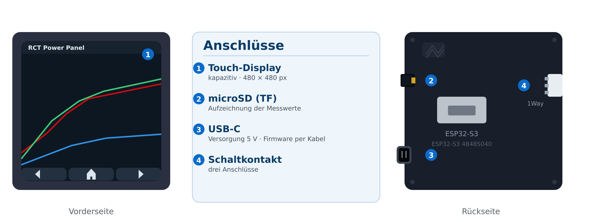
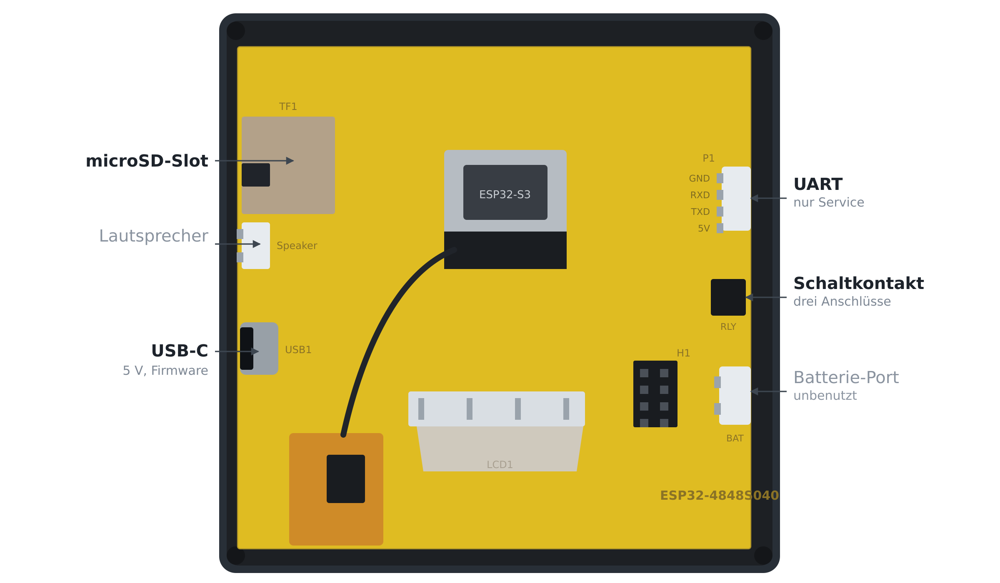
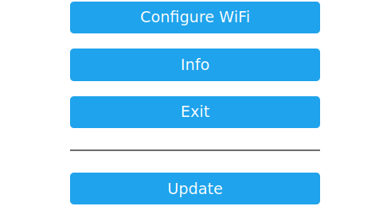
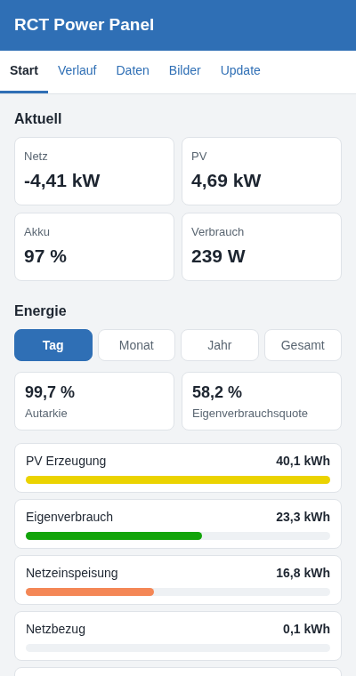

# RCT Power Panel <span class="h-sub">Benutzerhandbuch</span>

Das RCT Power Panel ist ein Wandpanel (4-Zoll-Farb-Touchdisplay) zur
Anzeige der Live-Daten Ihres RCT-Power-Wechselrichters. Es liest die Werte
direkt über das Netzwerk aus dem Wechselrichter (TCP, Standard-Port 8899),
zeigt sie auf sieben übersichtlichen Seiten an und zeichnet die Messwerte
zusätzlich automatisch auf einer microSD-Karte auf.

<figure class="ports-shot">
  
  <figcaption>Bild 1: Vorder- und Rückseite mit den sechs Anschlüssen; die Nummern stehen auf den Ansichten</figcaption>
</figure>

---

## Kurzanleitung <span class="h-sub">Inbetriebnahme in 5 Schritten</span>

Sie brauchen nur zwei Angaben, sonst nichts weiter zu wissen:

1. den Namen und das Passwort Ihres WLAN,
2. die IP-Adresse Ihres RCT-Wechselrichters — das Gerät zeigt sie
   gelegentlich direkt auf seinem Display an.

Der Port ist einheitlich `8899` und bereits voreingestellt — dort ist
nichts einzutragen.

So geht's:

1. Panel anschließen — USB-C-Kabel an ein Netzteil, das Display zeigt
   sofort die Übersicht.
2. WLAN „RCT-Panel“ wählen — den Zugangspunkt erzeugt das Panel beim
   ersten Start (oder wenn kein gespeichertes Netzwerk erreichbar ist).
3. Portal öffnen — im Browser `http://192.168.4.1` aufrufen (die
   Konfigurationsseite öffnet sich meist von selbst).
4. Zwei Felder ausfüllen und speichern — WLAN-Name/-Passwort sowie die
   RCT-IP-Adresse (der Port ist bereits voreingestellt).
5. Fertig. Das Panel verbindet sich mit Ihrem WLAN und zeigt die
   Live-Daten. Der Zugangspunkt „RCT-Panel“ verschwindet dabei von selbst.

So sieht es danach aus: Oben die Statusleiste mit dem Verbindungsstatus
(`aktiv`, grün = alles gut), in der Mitte die aktuelle Seite; unten blättern
◀ / ▶ durch die sieben Seiten, ⌂ springt zur Übersicht. Details
zu den Seiten stehen in Kapitel 3, zur Einrichtung ab Kapitel 1.

Die Messwerte liegen außerdem auf der SD-Karte und lassen sich später im
Browser abrufen: IP-Adresse und Code dafür stehen auf der **Service-Seite**
(Kapitel 5).

---

## 1. Inbetriebnahme

### 1.1 Anschlüsse

Alle Anschlüsse liegen an den Seitenkanten und sind von der Seite zugänglich —
das Panel muss dafür nicht aus der Wand. Die Nummern in Bild 1 und Bild 2
gehören zusammen; „links“ und „rechts“ meinen die Rückseitenansicht.

| Nr. | Anschluss | Lage | Verwendung |
|---|---|---|---|
| 1 | Touch-Display | Vorderseite | Anzeige und Bedienung |
| 2 | microSD (TF) | linke Kante, oben | Aufzeichnung der Messwerte (Kapitel 4) |
| 3 | USB-C | linke Kante, unten | Versorgung mit 5 V, Firmware-Aktualisierung per Kabel (Kapitel 10) |
| 4 | Schaltkontakt | rechte Kante | potentialfreier Kontakt, drei Anschlüsse (Kapitel 6) |

<figure class="board-shot">
  
  <figcaption>Bild 2: Rückseite der Platine mit allen Anschlüssen an ihrer Stelle. Grau: von der Firmware nicht benutzt.</figcaption>
</figure>

Der Schaltkontakt ist potentialfrei und schaltet die Last selbst — dazu mehr in
Kapitel 6. Am Panel selbst liegen nur die 5 V der USB-Versorgung an; an keinem
Anschluss darf Netzspannung angeschlossen werden. Auf der Platine ist nicht
beschriftet, welcher der drei Anschlüsse welcher ist; Bild 2 zeigt die Kante,
an der sie liegen.

### 1.2 Erstes Einschalten

1. Panel mit 5 V versorgen. Das Display startet sofort.
2. Ohne gespeichertes WLAN startet das Panel selbst einen eigenen
   WLAN-Zugangspunkt (AP) mit dem Namen `RCT-Panel` — auch dann, wenn
   kein Netzwerk erreichbar ist.
3. Mit einem Smartphone/Laptop verbinden Sie sich mit diesem WLAN und öffnen
   die Konfigurationsseite unter `http://192.168.4.1` (ein Captive-Portal
   öffnet sich meist automatisch).

### 1.3 Konfiguration im Setup-Portal

Tragen Sie im Portal ein:

| Feld | Bedeutung | Vorgabe |
|---|---|---|
| WLAN-Name / Passwort | Ihr Heimnetzwerk | — |
| `rct_host` | IP-Adresse oder Hostname des RCT-Wechselrichters | `192.168.0.1` |
| `rct_port` | TCP-Port für das RCT-Protokoll | `8899` |

Bestätigen Sie das Formular. Das Panel speichert die Angaben dauerhaft
(NVS) und wechselt dann ins konfigurierte Netzwerk — der Zugangspunkt
`RCT-Panel` verschwindet dabei erwartungsgemäß.

> **Tipp:** Der Zugangspunkt bleibt so lange aktiv, bis das Panel erfolgreich
> konfiguriert ist. Bei falschem Passwort oder nicht erreichbarem Netzwerk
> öffnet sich das Portal automatisch wieder, damit Sie die Angaben
> korrigieren können.

<figure class="portal-shot">
  
  <figcaption>Bild 3: Konfigurationsportal unter http://192.168.4.1 mit den Feldern für WLAN und RCT-Adresse</figcaption>
</figure>

### 1.4 Später erneut konfigurieren

- Öffnen Sie auf der Seite Service den Button „Setup starten“ — das
  Panel startet daraufhin wieder den Konfigurations-Zugangspunkt.
- Oder starten Sie das Panel, während kein gespeichertes Netzwerk erreichbar
  ist (nach ca. 15 s erscheint der AP von selbst).
- Zum vollständigen Zurücksetzen auf Werkseinstellung kann der
  NVS-Speicher gelöscht werden (Entwickler-Anleitung, Abschnitt 10).

---

## 2. Bedienung

Die Bedienung erfolgt per Touch:

- ◀ / ▶ (linker/rechter Knopf unten): eine Seite zurück bzw. weiter.
- ⌂ (Home-Mitte): springt zur Übersicht.
- Die Reihenfolge der Seiten ist fest: Übersicht → Energie → Heute →
  24 h Verlauf → Info → Akku → Service (und wieder zurück).

Statusleiste (oben): links steht „RCT Power Panel“, rechts der
Verbindungsstatus:

| Badge | Bedeutung |
|---|---|
| `aktiv` (grün) | Wechselrichter verbunden, Daten aktuell |
| `verbinde` (gelb) | WLAN und Verbindung werden gerade aufgebaut |
| `keine Daten` (rot) | WLAN steht, aber es kommen keine RCT-Daten an |
| `verbinde neu` (gelb) | Daten kamen, der Datenstrom ist abgerissen — Neustart der Verbindung |

Zeigt eine Seite „–“ statt eines Wertes, ist dieser Wert noch nicht
eingetroffen (z. B. weil der Wechselrichter keine Batterie meldet oder die
Verbindung fehlt). Es sind keine Werte ausgefallen — das Panel zeigt keinen
erfundenen Nullwert an.

### Licht und Ruhe

Lässt man das Panel in Ruhe, geht das Licht von selbst aus:

| Zeit ohne Bedienung | Anzeige |
|---|---|
| bis 3 Minuten | volle Helligkeit |
| ab 3 Minuten | auf 30 % gedimmt, Werte sind weiterhin lesbar |
| ab 5 Minuten | Licht aus, das Display ist schwarz |
| erste Berührung | sofort wieder hell, die Zeiten beginnen von vorn |

Es ist ausschließlich eine Berührung nötig — das Panel hellt nicht von selbst
wieder auf. Ein Druck auf einen Knopf oder einfach eine Berührung des Bildes
genügt; längeres Auflegen des Fingers hält es dauerhaft hell.

Die Zeiten sind fest eingestellt und lassen sich nicht ändern. Läuft das Panel
ohne erkannten Touch-Regler (dann ist auch keine Bedienung möglich), bleibt das
Licht aus Sicherheitsgründen immer an.

---

## 3. Die sieben Seiten im Einzelnen

### 3.1 Übersicht (Energiefluss)

Das Flussdiagramm bildet die „Energiefluss“-Ansicht des RCT-Portals ab:

- PV (links): Erzeugung aus Solar-Generator A und B plus optionalem
  externen S0-Zähler.
- Haus (Mitte): aktueller Verbrauch. Hinweis: Der Wechselrichter zieht
  die externe Einspeisung bereits von seiner Lastmessung ab; das Panel
  addiert den S0-Wert wieder hinzu, sodass hier der tatsächliche
  Hausverbrauch steht.
- Netz (rechts): Bezug oder Einspeisung (negativer Wert = Einspeisung).
- Batterie (unten): Ladezustand in Prozent (im Knoten) und aktuelle
  Leistung unter dem Knoten.

Die Pfeile zwischen den Knoten leuchten rot in Richtung des aktuellen
Energieflusses. Unten zeigt eine Tabelle den Stand von Erzeugung /
Verbrauch / Netz / Batterie.

### 3.2 Energie (Balken pro Zeitraum)

Akkumulierte Energien als Balken — wählbar über die Tasten
Tag | Monat | Jahr | Gesamt:

| Balken | Farbe | Erklärung |
|---|---|---|
| PV Erzeugung | gelb | erzeugte Energie |
| Eigenverbrauch | grün | erzeugt und selbst genutzt (= PV − Einspeisung, nie negativ) |
| Netzeinspeisung | orange | eingespeiste Energie |
| Netzbezug | rot | aus dem Netz bezogene Energie |
| Verbrauch | türkis | gesamter Verbrauch |

Die Balken sind zum größten Wert des gewählten Zeitraums normiert; die
Werte stehen rechtsbündig über dem jeweiligen Balken (kWh bzw. MWh mit
Dezimalkomma).

### 3.3 Heute (Tagesübersicht)

Die Tageswerte des aktuellen Kalendertags:

- Erzeugt / Eigenverbrauch / Eingespeist (kWh),
- Verbrauch / Bezug (kWh),
- Autarkie (%): = 1 − Netzbezug ÷ Hausverbrauch des Tages
- Eigenverbrauch (%): Anteil der Erzeugung, der selbst genutzt wird.

Hinweis: Entlädt sich die Batterie zur Deckung des Hausbedarfs, zählt diese
Energie als Eigenverbrauch.

### 3.4 24 h Verlauf

Liniendiagramm der letzten 24 Stunden (ein Punkt alle 5 Minuten, 288 Punkte):

| Linie | Farbe |
|---|---|
| Netz | rot |
| Verbrauch | violett |
| PV | grün |
| EXT (externer S0-Zähler) | blau |
| Batterie | orange |
| SOC (Ladezustand) | gelb — auf eigener Achse 0–100 %: 0 % = unterer Rand, 100 % = oberer Rand |

- Die Y-Achse der Leistungswerte skaliert automatisch: Sie wächst, sobald
  ein neuer Höchstwert auftritt, und schrumpft wieder, sobald dieser aus dem
  24-Stunden-Fenster fällt. Links am Diagramm stehen Markierungen für
  Minimum, 0 und Maximum (in kW mit Dezimalkomma).
- Batterie positiv = Entladen (versorgt das Haus), negativ = Laden.
- Fehlende Daten (z. B. Gerätepause) erscheinen als Lücke in den Linien; die
  Zeile unter dem Diagramm nennt die Lückenlänge („… Lücke(n), insgesamt
  … s").
- Der Verlauf übersteht einen Neustart: Beim Hochfahren lädt das Panel
  die letzten bis zu 24 Stunden von der SD-Karte zurück.

### 3.5 Info

Technische und Verbindungsdaten (Reihenfolge wie angezeigt):

`Name` · `Software` · `RCT host` · `RCT port` · `Link` (verbunden/getrennt) ·
`Last data` (Sekunden seit letztem Datenpaket) · `Uptime` ·
`Netz L1..L3` · `PV` (A+B+S0) · `Kern` · `Kühlkörper` · `Netzfrequenz`.

### 3.6 Akku

Alles zur Batterie:

- Batterie-SOC: Ladezustand in %.
- Batterie: Leistung / Strom / Spannung. Batteriezentrisches
  Vorzeichen: Laden = „+“, Entladen = „−“ — also umgekehrt zum
  Flussdiagramm auf der Übersicht, wo das Entladen (Versorgung des Hauses)
  positiv ist.
- Batterie-Temp · Kalibrierung (nächster Kalibriertermin als Datum +
  Tages-Countdown, sobald die Uhrzeit synchronisiert ist) · Zyklen ·
  SOH (State of Health) · Inselbetrieb.

### 3.7 Service

Die einzige Seite mit Aktionen:

- „Setup starten“ (rechts oben): öffnet das Konfigurationsportal (siehe
  Abschnitt 1.3).
- Batterie-Status: decodierter Zustand, darunter die IP-Adresse des Panels —
  die brauchen Sie, um die Web-Oberfläche im Browser zu öffnen (Kapitel 5).
  Steht kein Netz, finden Sie dort `kein Netz`. Rechts daneben, in grauer
  Schrift, der Rohwert des Statusregisters als Hexzahl (nur für die
  Fehlersuche).
- Störungen: decodierte Fehlermeldungen des Wechselrichters (mehrere
  können gleichzeitig aktiv sein).
- SD-Log: Status der SD-Aufzeichnung, z. B. `SD: OK | 16,0 GB frei` —
  bei gezogener Karte `SD: -- | n gepuffert (11 h)` (Werte werden
  zwischengepuffert; siehe Abschnitt 4).
- „Screenshot“ (rechts, unter „Setup starten“): speichert nach 5
  Sekunden ein Bild des aktuellen Displays als BMP auf die Karte
  (`/shot/shot001.bmp`). Die 5 Sekunden erlauben, vorher zu einer anderen
  Seite zu wechseln. Praktisch, wenn Sie dem Support zeigen möchten, was das
  Panel anzeigt. Ist eine Aufnahme nicht vollständig auf die Karte gekommen,
  steht hier `fehlgeschlagen` und die halbe Datei wird gelöscht — eine
  unvollständige Datei auf der Karte ist schlimmer als gar keine.
- Web-Oberfläche (rechts, unter den beiden Knöpfen): der vierstellige Code,
  den diese Seiten für Änderungen verlangen. Er ist nur belegt, solange das
  Panel im Netz ist. Tippen Sie auf den Code, zieht das Panel sofort einen
  neuen — nützlich, wenn jemand über Ihre Schulter mitgelesen hat.
- Ausgang (unten): der Schaltkontakt am Relais-Port. `Ausgang` nennt die
  eingestellte Funktion mit ihrer Schwelle in Watt; Tippen Sie darauf,
  wechselt die Funktion. Darunter steht, was gerade passiert (`AN · 512 W
  jetzt`). Der Knopf daneben prüft für 20 Sekunden, ob am Port überhaupt
  etwas schaltet. Siehe Kapitel 6.

---

## 4. Datenerfassung auf der SD-Karte

Das Panel schreibt automatisch alle 5 Minuten einen Datensatz in eine
CSV-Datei (nur bei verbundenem Wechselrichter, keine Nullzeilen):

- Datei: `/hist/RCT-<Jahr><Monat>.csv` (z. B. `RCT-202609.csv`),
  eine Datei pro Kalendermonat. Läuft die Uhr (SNTP) beim Start noch nicht,
  schreibt das Panel zunächst in eine Uptime-Datei und wechselt nach der
  Zeitsynchronisation automatisch auf die Monatsdatei.
- Umfang: ca. 32 KB pro Tag ≈ 1 MB pro Monat — eine übliche Karte
  reicht jahrzehntelang.
- Karte gezogen: Solange keine Karte steckt, werden die Zeilen im Speicher
  des Panels zwischengelagert und nach dem Einstecken in der richtigen
  Reihenfolge nachgeschrieben. Der Puffer fasst 24 Stunden (288 Zeilen,
  das ist der Arbeitsspeicher, nicht die Karte). Die Service-Seite zeigt den
  Pufferstand mit Zeitangabe, z. B. `SD: -- | 137 gepuffert (11 h)`.
- Die Dateien müssen Sie nicht aus der Karte auslesen: Das Panel liefert sie
  im Netz als Download aus (Kapitel 5).

> **Hinweis:** Die Karte wird mit 4 MHz angesprochen, was die Übertragung
> gegenüber den anfänglichen 400 kHz um etwa das Zehnfache beschleunigt.
> Das Panel prüft nach dem Einbinden der Karte selbst, ob dieser Takt trägt
> (512 Byte schreiben, lesen, vergleichen) und schaltet andernfalls
> automatisch auf die langsamere, bewährte Stufe zurück. Sie müssen nichts
> einstellen.

### Welche Karte das Panel braucht

| Merkmal | Anforderung |
|---|---|
| Format | microSD/microSDHC/microSDXC im Steckplatz auf der Platine (TF) |
| Dateisystem | **FAT32** — empfohlen und erprobt. FAT12/FAT16 funktionieren ebenfalls (eine 2-GB-Karte ist ab Werk FAT16) |
| Nicht unterstützt | **exFAT** — besonders wichtig: Karten ab 64 GB werden ab Werk exFAT geliefert |
| Kapazität | 4 GB bis 32 GB ist der unkomplizierte Bereich; jede FAT32-partitionierte Karte ist lesbar und beschreibbar |
| Formatierung | eine einzige Partition, vor dem ersten Einsatz mit einem FAT32-Dateisystem versehen |
| Geschwindigkeit | belanglos: 32 kB pro Tag, auch die langsamste Klasse reicht |
| Schreibschutz | im Steckplatz nicht vorhanden — die Karte muss also nicht auf Schreibschutz stehen |

Praktisch ist jede gebräuchliche 8-GB- oder 16-GB-Karte die richtige Wahl.
Wenn Sie eine sehr große Karte einsetzen wollen, achten Sie darauf, dass sie
als **FAT32** formatiert ist: Windows formatiert Karten ab 32 GB nur noch als
exFAT, dort hilft dann ein FAT32-Werkzeug (z. B. `mkfs.fat -F32` unter Linux/macOS,
oder ein Formatierer wie „guiformat“ mit der Option „FAT32“). exFAT kann das
Panel weder lesen noch beschreiben — es findet dort kein Dateisystem und meldet
`SD: --`, wiederholt den Versuch alle 10 Sekunden und puffert die Messwerte
weiter im RAM.

Das Panel formatiert die Karte nicht selbst: Es legt nur die beiden
Ordner `/hist` (Messwerte) und `/shot` (Screenshots) an, wenn sie fehlen. Alles
andere auf der Karte bleibt unangetastet, Sie können also eigene Ordner
daneben anlegen.

Der Platzbedarf ist vernachlässigbar: rund 11,7 MB pro Jahr, eine 1-GB-Karte
wäre damit rund 85 Jahre lang ausreichend. Auch die Verschleißreserve spielt
keine Rolle, es wird nur alle fünf Minuten ein Block angehängt.

### CSV-Format (16 Spalten)

```
ts,pv_a,pv_b,s0,temp_core,temp_bat,temp_hsink,
load_l1,load_l2,load_l3,bat,soc,grid_l1,grid_l2,grid_l3,status
```

| Spalte | Bedeutung | Einheit |
|---|---|---|
| `ts` | Unix-Zeitstempel | s |
| `pv_a`, `pv_b` | PV-Leistung Generator A / B | W |
| `s0` | externer S0-Zähler | W |
| `temp_core`, `temp_bat`, `temp_hsink` | Temperaturen Kern / Batterie / Kühlkörper | °C |
| `load_l1..l3` | Verbrauch pro Phase (Haus) | W |
| `bat` | Batterieleistung (positiv = Laden) | W |
| `soc` | Ladezustand | % |
| `grid_l1..l3` | Netz-Leistung pro Phase (positiv = Bezug) | W |
| `status` | Status-/Fehlerbitmaske | — |

Die Datei ist direkt mit Tabellenkalkulationen, pandas oder Grafana
auswertbar. Leistungen und Temperaturen stehen in Watt bzw. Grad Celsius,
der Zeitstempel in Unix-Sekunden (UTC); das Panel selbst rechnet für die
Monatsdatei über die SNTP-Zeit.

---

## 5. Web-Oberfläche <span class="h-sub">Daten abrufen, Firmware aktualisieren</span>

Solange das Panel im Heimnetz ist, betreibt es auf Port 80 einen eigenen
Webserver. Sie erreichen ihn über die IP-Adresse, die auf der **Service-Seite**
unter `Batterie-Status` steht — im Beispiel `http://192.168.1.42`. Unter dem
Namen `rct-panel.local` ist er zusätzlich erreichbar, sofern Ihr Netz solche
Namen auflöst (das ist eine Bequemlichkeit: wenn Ihr Netz das nicht kann,
nehmen Sie die IP-Adresse).

> **Hinweis:** Es ist ausschließlich das lokale Netz erreichbar, nicht das
> Internet. Ein Update oder ein Datenabruf findet immer zwischen einem Gerät
> in Ihrem Netz und dem Panel statt; die Binärdatei wandert nicht über
> fremde Server.

### Seiten

| Adresse | Inhalt |
|---|---|
| `/` | Übersicht: Netz, PV, Akku, Karte, Ausgang, Adresse, Wartung |
| `/daten` | Liste der aufgezeichneten CSV-Dateien |
| `/bilder` | Liste der gespeicherten Screenshots |
| `/update` | Firmware aktualisieren |

<figure class="web-shot">
  
  <figcaption>Bild 4: Die Übersichtseite — oben die aktuellen Werte, unten die Geräteangaben und die Adresse, unter der das Panel erreichbar ist</figcaption>
</figure>

### Daten abrufen

Auf `/daten` und `/bilder` steht je Eintrag ein Knopf:

- Bei den Daten holt **„laden“** die letzten 64 kB der Datei — das sind
  bei der Fünf-Minuten-Taktung etwa zwei Tage. Der Browser zeigt den
  Fortschritt als Balken; die Übertragung ist inzwischen schnell, die letzten
  64 kB dauern Bruchteilsecunden. Für mehr hängen Sie `?tail=0` an den Link
  an, dann kommt die gesamte Monatsdatei (etwa 1,2 MB, gut zwei Sekunden).
- Bei den Bildern öffnet **„anzeigen“** den Screenshot im Browser. Auch hier
  läuft der Download mit Fortschrittsanzeige.

Unter der Bildliste steht der Knopf „Screenshot auslösen“: er nimmt ein Bild
der aktuellen Seite auf und legt es wie die Panel-Taste als BMP auf die Karte. Der
Knopf verlangt den Code (unten). Das Schreiben dauert etwa 3 bis 5 Sekunden;
danach lädt sich die Seite einmal neu und die neue Datei steht in der Liste.
Ohne die Wartezeit des Panels, denn im Browser sind Sie bereits auf der Seite,
die aufgenommen werden soll.

Während ein Download läuft, bedient das Panel keine weiteren Anfragen — der
Vorgang ist abgeschlossen, bevor der nächste startet. Das ist Absicht: so
bleibt die Übertragung in sich abgeschlossen und ein zweiter Zugriff kann die
Datei nicht dazwischen auf der Karte verändern.

### Der Code

Ansehen und Herunterladen dürfen alle im Netz. Was das Panel verändert,
verlangt den vierstelligen Code:

- Firmware aktualisieren (`/update`),
- Neustart,
- WLAN neu einrichten,
- Funktion und Schwelle des Schaltausgangs,
- Screenshot auslösen (Knopf unter der Bildliste auf `/bilder`).

Der Code steht auf der Service-Seite und wird bei jedem Start des Panels neu
gezogen; er wird nicht gespeichert und ist nach einem Neustart ein anderer.
Ein Neucode ziehen Sie jederzeit durch Antippen des Codes auf der
Service-Seite. Der Code schützt vor einem Nachbarn im selben Netz, der die
Adresse kennt — nicht vor jemandem, der das Display ablesen kann.

### Der Schaltausgang

Oben auf der Übersichtsseite steht der Schaltausgang (Kontakt) mit
aktuellem Zustand und Funktion. Darunter wählen Sie die Funktion und die
Schwelle und übernehmen sie — hinter dem Code, denn es ändert das Panel.
Ausführlich beschrieben ist der Ausgang in Kapitel 6.

### Firmware aktualisieren

Voraussetzung ist ein Build, wie in Kapitel 10 beschrieben
(`pio run -e esp32-s3` erzeugt `firmware.bin`).

1. Panel und Rechner im selben Netz; Adresse von der Service-Seite holen.
2. `http://<Adresse des Panels>/update` öffnen.
3. Code eintragen, `firmware.bin` auswählen, „Firmware schreiben“.
4. Das Panel schreibt die Datei in den zweiten Speicherbereich und startet
   neu — gespeichertes WLAN und die Wechselrichter-Konfiguration bleiben
   erhalten. Das Display bleibt währenddessen an.

> **Tipp:** Läuft ein Update schief, startet das Panel mit der bisherigen
> Firmware weiter: Die neue Datei wird vor dem Start auf Vollständigkeit
> geprüft, und der zweite Speicherbereich bleibt als Reserve unangetastet.
> Ein fehlgeschlagenes Update macht das Gerät also nicht unbrauchbar.

> **Hinweis:** Ist das Panel gerade nicht im Heimnetz (etwa weil das WLAN
> umgestellt wurde), gibt es einen zweiten Weg: auf der Service-Seite „Setup
> starten" antippen, mit dem WLAN `RCT-Panel` verbinden und dann
> `http://192.168.4.1/update` aufrufen. Dort wird kein Code verlangt, weil
> das Gerät in diesem Zustand ohnehin nichts anderes erreicht.

---

## 6. Der Schaltausgang <span class="h-sub">Verbraucher automatisch schalten</span>

Am Schaltkontakt des Panels (Aufdruck „1Way“) sitzt ein potentialfreier
Kontakt: kein eigener Transformator, sondern ein Relais, das Ihren Verbraucher
direkt schaltet. Damit das Panel mehr kann als anzeigen, folgt der
Ausgang einer Regel, die Sie wählen.

### Anschluss

Der Port ist dreipolig. Auf der Platine steht nicht, welcher Anschluss welcher ist;
auf der Platine steht es nicht. Der Testknopf auf der Service-Seite entscheidet
es: Bei ausge schaltetem Ausgang (Funktion `Aus`) hat ein Paar der drei
Anschlüsse immer Durchgang — das ist gemeinsamer Anschluss und Öffner. Der
dritte Anschluss hat nur dann Durchgang, wenn der Ausgang einschaltet; das ist
der gemeinsame Anschluss und der Schließer. Der Rest ist normale
Verdrahtung: gemeinsamer Anschluss an die Phase des zu schaltenden Kreises,
Schließer an die Leitung zur Last, Öffner an den Rückleiter, wenn der
Kontakt im geschlossenen Zustand öffnen soll.

| Anschluss am Port | Angeschlossen an |
|---|---|
| gemeinsamer Anschluss (COM) | Phase des zu schaltenden Kreises |
| Schließer (NO) | Leitung zur Last |
| Öffner (NC) | Rückleiter, wenn der Kontakt im eingeschalteten Zustand öffnen soll |

### Spannungen am Relais-Port

Am Port liegen zwei ganz verschiedene Dinge an, und sie dürfen nicht
verwechselt werden:

| Seite | Was dort anliegt |
|---|---|
| Ansteuerung, intern | 3,3 V Logikpegel am GPIO 40; damit wird allein die Relaisspule geschaltet |
| Kontakt (COM, NO, NC) | potentialfrei: trägt die Spannung des angeschlossenen Kreises, bei 230 V also 230 V AC |

Am Panel selbst liegen nur die 5 V der USB-Versorgung an. An keinem Anschluss
und an keinem GPIO des Panels darf Netzspannung angeschlossen werden.

Zwei Dinge sind außerdem wichtig:

- Der Kontakt ist potentialfrei: aus dem Panel kommt keine Spannung in den
  Kreis, sondern nur ein Kontakt, der ihn öffnet und schließt.
- Arbeiten am Schaltkreis gehören in Fachhände. Er gehört in eine
  Verteilung, in der er abgesichert und durch einen Fehlerstromschutzer
  geschützt ist.

Zur Belastbarkeit nennt dieses Handbuch bewusst keine Zahl: sie hängt vom
verbauten Relais ab und steht auf dem Bauteil und in dessen Datenblatt. Vor
dem Anschluss einer Last sind drei Angaben zu prüfen: Kontaktstrom bei
ohmscher Last, Anlaufstrom bei Motoren und Leuchtstoffmitteln, und die
Schalthäufigkeit. Eine Speicherheizung, eine Wärmepumpe oder ein
Wasserkocher gehören nicht an einen Kontakt, dessen Nennstrom man nicht
kennt.

### Die fünf Funktionen

| Portal-Nr. | Funktion | Schaltet ein, wenn |
|---|---|---|
| 0 | **Aus** (Vorgabe) | nie |
| 1 | **Netzbezug** | der Bezug aus dem Netz über der Schwelle liegt |
| 2 | **Überschuss** | der PV-Überschuss über der Schwelle liegt |
| 3 | **Störung** | der Wechselrichter eine Störung meldet |
| 4 | **Inselbetrieb** | das Netz getrennt ist (die Anlage läuft im Inselbetrieb weiter) |

> **Hinweis:** *Überschuss* heißt hier: was die beiden PV-Stränge und die
> anderen Generatoren erzeugen, minus den Hausverbrauch. Energie von einem
> fremden S0-Zähler zählt nicht als Ihr Überschuss — sonst würde das Panel eine
> Last einschalten, die von einem anderen Generator bezahlt wird.

### Einstellen

Drei Wege, alle drei gleichwertig:

1. Auf dem Panel: Service-Seite, Feld `Ausgang` antippen — jedes Antippen
   springt zur nächsten Funktion (`Aus` → `Netzbezug` → `Überschuss` →
   `Störung` → `Inselbetrieb` → `Aus`). Die gewählte Funktion bleibt auch nach
   einem Neustart erhalten.
2. In der Weboberfläche (Kapitel 5): Auswahlfeld für die Funktion und ein
   Zahlenfeld für die Schwelle in Watt. Das ist der einzige Weg, eine Schwelle
   in Watt bequem einzugeben — für das Tippen auf Zahlen braucht es eine
   Tastatur.
3. Im Setup-Portal: die Felder `relay_mode` (0 bis 4, siehe Tabelle) und
   `relay_w` (Watt). Für den Fall, dass das Panel gar nicht im Heimnetz ist.

### Das Zeitverhalten

Damit der Ausgang nicht flattert, arbeitet er mit zwei Zeitfenstern und einer
Hysterese:

- 20 Sekunden muss die Bedingung über der Schwelle liegen, dann schaltet
  der Ausgang ein.
- Mindestens 60 Sekunden bleibt er nach dem Einschalten an — auch wenn die
  Bedingung in der Zwischenzeit unterschritten wird.
- Die **Hysterese** beträgt 20 % der Schwelle: bei 500 W schaltet der Ausgang
  bei 500 W ein und bei 400 W wieder aus. Ohne das würde ein Wert, der genau auf
  der Schwelle steht, alle zehn Sekunden umschalten.
- Keine Daten vom Wechselrichter (länger als zwei Minuten) heißt: aus. Ein
  Ausgang, der wegen eines verschwundenen Wechselrichters eingeschaltet
  bliebe, wäre die schlechtere Variante.

Die Zwei-Minuten-Frist steht fest in der Firmware und ist eine Annahme, keine
Messung. Manche Wechselrichter liefern mehrere Minuten keine Werte, obwohl die
Verbindung offen ist — dann schaltet der Ausgang in dieser Zeit einmal ab und
sobald wieder Werte kommen wieder ein. Wenn das an Ihrem Gerät auftaucht, gehört
die Frist verlängert; das ist eine Zeile in der Firmware, kein Umbau.

### Anzeige und Test

Auf der Service-Seite zeigt das Panel darunter, was gerade passiert:
`AN · 512 W jetzt` oder `AUS · 120 W jetzt`. Die Zahl ist der Wert, gegen den
verglichen wird — ohne sie wäre die Schwelle in Watt eine Zahl, die niemand
sinnvoll einstellen kann.

Der Knopf „Test: 5 s an, 5 s aus“ schaltet den Ausgang zweimal ein und
aus, unabhängig von der Regel und ohne Daten vom Wechselrichter. Damit lässt
sich prüfen, ob am Port überhaupt etwas passiert.

> **Tipp:** Der Ausgang ist beim Start immer aus, und die Voreinstellung ist
> die Funktion `Aus`. Sie müssen also nichts tun, damit beim Einschalten
> nichts passiert — erst eine Auswahl macht ihn zu einem Automaten.

> **Hinweis:** Der Ausgang ist ein Automat, kein Schutz. Er schaltet nach
> Messwerten und ist weder Fehlerstromschutz noch Überlastschutz. Wenn Sie
> eine Speicherheizung oder eine Wärmepumpe damit betreiben, prüfen Sie die
> Grenzen des Kontakts (siehe Kapitel 11) und die Absicherung des
> Anschlusses — die Arbeiten am Schaltkreis gehören in Fachhände.

---

## 7. Hinweise <span class="h-sub">kompakt</span>

| Größe | Konvention |
|---|---|
| Netz (Übersicht, Verlauf, Info) | `+` = Bezug, `−` = Einspeisung |
| Batterie auf Übersicht & Verlauf | `+` = Entladen (versorgt Haus), `−` = Laden |
| Batterie auf der Akku-Seite | `+` = Laden, `−` = Entladen (batteriezentrisch) |
| Batterie in der CSV (`bat`) | `+` = Laden |
| Hausverbrauch | = gemessene Last + S0 (der Wechselrichter misst die Last abzüglich der externen Einspeisung) |
| PV gesamt | = A + B + S0 |
| SD-Karte | FAT32, 4–32 GB empfohlen, exFAT wird nicht unterstützt (Abschnitt 4) |

---

## 8. Fehlerbehebung

| Symptom | Ursache / Lösung |
|---|---|
| Badge `keine Daten` (rot) | WLAN steht, der Wechselrichter antwortet nicht. Prüfen Sie `rct_host`/`rct_port` im Setup-Portal und ob der Wechselrichter erreichbar ist. |
| Badge `verbinde` bleibt | WLAN-Verbindung wird aufgebaut; wenn es nicht weitergeht, prüfen Sie das WLAN-Passwort (Portal öffnet sich nach ~15 s erneut). |
| Badge `verbinde neu` | Datenstrom abgerissen; das Panel versucht automatisch neu zu verbinden. |
| Kein Konfigurationsportal auffindbar | Panel ist bereits in einem Netzwerk — nutzen Sie „Setup starten“ auf der Service-Seite. |
| `SD: --` auf Service-Seite | Keine Karte erkannt oder Karte gezogen; prüfen Sie die microSD im Steckplatz (**FAT32**, kein exFAT — Abschnitt 4). Ohne Karte werden die Daten bis zu 24 h im Panel gepuffert und danach nachgeschrieben. |
| `SD: OK \| n Zeilen verloren` | Der Puffer war länger voll als 24 h (Karte mehrere Tage weg) oder die Karte war voll. Die Anzahl ist die Zahl der endgültig verlorenen Zeilen. |
| Werte auf „–“ | Wechselrichter liefert diesen Wert nicht (z. B. keine Batterie) — normal. |
| Webseite lässt sich nicht öffnen | IP-Adresse von der Service-Seite (unter `Batterie-Status`) im Browser eintragen; steht dort `kein Netz`, ist das Panel nicht im Heimnetz. |
| „Der Code stimmt nicht“ | Code von der Service-Seite; er ändert sich bei jedem Start des Panels. Antippen zieht einen neuen. |
| Download bricht ab | Der Browser hat die Verbindung geschlossen (Ruhezustand, Netzwechsel). Der Vorgang lässt sich einfach wiederholen. |
| `/daten` bleibt leer | Auf der Karte steht noch keine Datei — es wird erst ab dem ersten Fünf-Minuten-Wert geschrieben. |
| Ausgang schaltet nicht | Erst die Funktion prüfen (Service-Seite, Feld `Ausgang`): `Aus` schaltet nie. Bei `Netzbezug`/`Überschuss` muss der Wert die Schwelle 20 s lang übersteigen — die angezeigte Zahl ist der Wert, der gerade verglichen wird. |
| Ausgang schaltet ständig | Schwelle zu niedrig angesetzt. Der Wert pendelt um die Schwelle, weil 20 % Hysterese zu wenig sind, wenn die Last grob springt. Schwelle erhöhen. |
| Ausgang war 2 Minuten lang aus | Zwei Minuten lang keine Werte vom Wechselrichter — das kann auch bei offener TCP-Verbindung passieren. Ohne Daten schaltet der Ausgang aus, siehe Kapitel 6. |
| Ausgang schaltet nach dem Neustart nicht | Er schaltet 20 Sekunden nach dem Start frühestens ein. Das Display zeigt aber sofort, welche Funktion eingestellt ist. |
| Display ist schwarz | Nach 5 Minuten ohne Bedienung ist das Licht aus (Abschnitt 2) — einmal das Display berühren. Bleibt es dunkel, ist der Touch-Regler nicht erkannt; dann hilft nur ein Neustart, und das Licht bleibt anschließend dauerhaft an. |

---

## 9. Sicherheit

- Das Panel ist ein Anzeigegerät und greift nicht in die
  Wechselrichter-Konfiguration ein.
- Arbeiten an elektrischen Anlagen (Wechselrichter, Zählerschrank) gehören in
  Fachhände — das Panel selbst wird nur mit Kleinspannung (5 V) versorgt.
- Der Schaltausgang ist ein potentialfreier Relaiskontakt, kein elektronischer
  Schalter. Die Grenzen (Kontaktbelastbarkeit, Anlaufstrom von Motoren und
  Leuchtstoffmitteln) stehen in Kapitel 11; ein Relais ist nicht für alles
  ausgelegt, was ein Verbrauch anfordert.
- Der Ausgang folgt Messwerten. Er ist kein Fehlerstromschutz, kein
  Überlastschutz und keine Garantie, dass eine angeschlossene Last
  ausschließlich mit Solarstrom läuft.
- Der Code der Weboberfläche schützt vor einem Nachbarn im selben Netz. Er ist
  kein Passwort und kein Schutz gegen jemanden mit physischem Zugang zum
  Gerät.
- Die angezeigten Werte dienen der Beobachtung; für abrechnungsrelevante
  Daten gilt das Portal des Herstellers.

---

## 10. Entwickler: Firmware aktualisieren (Kurzfassung)

Quellcode und Build liegen in diesem Repository (`rct-panel`). Voraussetzung:
PlatformIO (Core 6.x).

```sh
pio run -e esp32-s3              # bauen
pio run -e esp32-s3 -t upload    # flashen (USB)
pio device monitor               # serielle Diagnose, 115200 Baud
```

Diagnosemeldungen (z. B. `RCT: grid ...`) erscheinen im seriellen Monitor.
Zur Werkseinstellung zurück: `pio run -e esp32-s3 -t erase` (löscht
gespeichertes WLAN und RCT-Konfiguration).

### Update ohne USB (OTA)

Neben dem Flashen per USB lässt sich die Firmware über die Weboberfläche des Panels aktualisieren — ohne Kabel am Gerät. Dafür muss das Panel nicht einmal
im Setup-Modus sein: Es bringt die Update-Seite im Normalbetrieb selbst mit.

1. Rechner und Panel im selben Heimnetz. Die Adresse steht auf der
   Service-Seite unten, Feld `Adresse`.
2. `http://<Adresse>/update` aufrufen — die Firmware-Update-Seite des Panels.
3. Den vierstelligen Code eintragen (Service-Seite, Feld `Code`), die zuvor mit
   `pio run -e esp32-s3` gebaute `firmware.bin` auswählen, „Firmware
   schreiben".
4. Das Panel schreibt die Datei in den zweiten App-Slot und startet neu.
   Gespeichertes WLAN und die RCT-Konfiguration bleiben erhalten; das Display
   bleibt an, die Seiten im Browser sind während des Schreibens nicht bedienbar.

Warum der Code, und warum er vorher geprüft wird: Ein Update verändert das
Gerät, alles andere auf diesen Seiten liest nur. Weil der WebServer die
Formularfelder der Reihe nach auswertet, steht das Code-Feld im HTML vor dem
Dateifeld — bei falschem Code wird kein einziges Byte in den Flash
geschrieben. Der Updater löscht seinen Zielbereich ohnehin erst schreibend
Block für Block, deshalb bleibt das Display währenddessen in Betrieb; ein
fehlgeschlagenes Update bootet anschließend die alte Firmware (Prüfsumme/Image-
Kennung, zweiter Slot unangetastet).

Als Rückfallweg, wenn das Panel nicht im Heimnetz ist (WLAN umgestellt,
falsche Adresse, Gerät gerade in einem anderen Netz): Service-Seite antippen →
„Setup starten“ → mit dem WLAN `RCT-Panel` verbinden → `http://192.168.4.1/update`.
In diesem Zustand wird kein Code verlangt, weil das Gerät dort ohnehin nichts
anderes erreichbar ist; es gibt nur das Konfigurationsportal.

Beide Wege bleiben im lokalen Netz. Ein Update über das Internet ist bewusst
nicht möglich — die Binärdatei kommt aus dem Netz direkt auf das Gerät.

> **Hinweis:** Zum Flashen verbinden Sie das Panel per USB mit dem Rechner
> und starten den Build mit Upload (siehe oben). Das Gerät startet danach
> automatisch neu; die SD-Aufzeichnung stört der Vorgang nicht.

---

## 11. Technische Daten

### Hardware

| Bezeichnung | Technische Daten |
|---|---|
| Anzeige | 4" IPS-Farbdisplay, 480 × 480 Pixel (ST7701 RGB) |
| Bedienung | kapazitives Touchpanel (GT911) |
| Prozessor | ESP32-S3, Dual-Core |
| Speicher | 16 MB Flash, 8 MB PSRAM |
| Anschlüsse | USB-C (Versorgung und Firmware per Kabel), microSD/TF, Schaltkontakt (3-polig); Bild 1 |
| Beleuchtung | LED-Hintergrundbeleuchtung hinter dem Display, stufenlos dimmbar |
| Datenspeicher | microSD/TF-Karte im Steckplatz auf der Platine; Dateisystem FAT32 (FAT12/16 auch lesbar, exFAT wird nicht unterstützt), empfohlen 4–32 GB, ca. 11,7 MB Datenvolumen pro Jahr; SPI 4 MHz mit Selbsttest, Rückfall auf 400 kHz; Pufferspeicher im Panel für 24 h |
| Stromversorgung | USB-C, 5 V DC |
| Logikpegel | 3,3 V an den internen Ausgängen; ausschließlich zum Ansteuern des Relais, keine Anschlussstelle für Fremdspannung |
| Spannung am Schaltkontakt | potentialfrei; der Kontakt trägt die Spannung des angeschlossenen Kreises (bei 230 V also 230 V AC). Nennstrom und Kontaktart stehen auf dem Relais und in dessen Datenblatt — dieses Handbuch nennt dafür bewusst keine Zahl. Zu prüfen vor dem Anschluss einer Last: Kontaktstrom bei ohmscher Last, Anlaufstrom bei Motoren und Leuchtstoffmitteln, Schalthäufigkeit |

### Funk

| Bezeichnung | Technische Daten |
|---|---|
| Standard | IEEE 802.11 b/g/n, 2,4 GHz |
| Verschlüsselung | WPA und WPA2 (Personal) |
| Fünf-Gigahertz | nein — der Funk des Panels arbeitet ausschließlich auf 2,4 GHz |
| Empfehlung | 2,4 GHz im Router aktiviert, Kanal 1, 6 oder 11, nicht völlig überlastetes WLAN |

Ein Router, der nur auf 5 GHz sendet, ist für das Panel unsichtbar. Bleibt die
Verbindung aus, obwohl der Name und das Passwort stimmen, ist das der erste
Grund zum Nachsehen — und nicht das Passwort.

### Unterstützte Wechselrichter

Jedes Gerät, das das RCT-Protokoll auf TCP-Port 8899 spricht — typischerweise
RCT-Power-Hybrid-Wechselrichter (6/8/10 kVA) und daraus abgeleitete Modelle.
Das Panel liest nur; es konfiguriert nichts.

Nicht geeignet sind Geräte ohne diese Schnittstelle, etwa Modelle, die nur über
RS485/Modbus an einem Akku hängen. Bietet ein Gerät zwar den Port an, meldet
aber einzelne Werte nicht (kein Akku, kein S0-Zähler), bleibt der betreffende
Wert auf „–“ — das ist kein Fehler (Abschnitt 8).

### Leistungsaufnahme

Richtwerte aus den Datenblättern der Bauteile, nicht am Gerät gemessen:

| Zustand | Richtwert |
|---|---|
| Betrieb, Licht voll | ca. 1,5–2,5 W |
| Betrieb, Licht 30 % (nach 3 min ohne Bedienung) | ca. 0,8–1,6 W |
| Betrieb, Licht aus (nach 5 min ohne Bedienung) | ca. 0,4–0,9 W |
| Relais eingeschaltet | zusätzlich ca. 0,2 W |

| Verursacher | Anteil |
|---|---|
| Hintergrundbeleuchtung | der größte Posten; bei 30 % sinkt er auf unter ein Drittel |
| ESP32-S3 mit WLAN und PSRAM | ca. 0,3–0,6 W |
| LCD und Panelansteuerung | ca. 0,2–0,4 W |
| SD-Karte | ca. 0,1 W, beim Schreiben mehr |

Das Panel dimmt und schaltet das Licht selbst aus (Abschnitt 2) — im Ruhezustand
bleibt damit nur der Verbrauch von Elektronik, Funk und Karte. Nachmessen lässt
es sich mit einem USB-Leistungsmessgerät zwischen Netzteil und Kabel; die
Angabe auf dem Netzteil gilt ohne Last ohnehin nichts.

### Funktionen

| Bezeichnung | Technische Daten |
|---|---|
| Datenabfrage | RCT-Wechselrichter über TCP (Port 8899), alle 10 s |
| Datenaufzeichnung | alle 5 Minuten als CSV (ca. 32 KB pro Tag), 24-h-Puffer im RAM bei fehlender Karte |
| Weboberfläche | HTTP-Server im lokalen Netz (Port 80): Status, CSV-/Bild-Download, Firmware-Update; änderende Funktionen mit 4-stelligem Code |
| Schaltausgang | potentialfreier Relaiskontakt, 3-polig (gemeinsam, Schließer, Öffner), 5 wählbare Funktionen, 20 s Einschaltverzögerung, 60 s Mindesthaltezeit, 20 % Hysterese; aus bei jedem Start |
| Ausgang bei Datenausfall | schaltet aus, wenn der Wechselrichter länger als 2 min keine Daten liefert |

Das Panel zeigt ausschließlich Messwerte an — es verändert keine Einstellungen
am Wechselrichter (eine Ausnahme: der Setup-Modus legt nur die eigenen
Netzwerk- und Verbindungsdaten des Panels fest).

### Datenfluss

- Das Panel liest alle Live-Werte alle 10 Sekunden aus dem Wechselrichter.
- Das Display aktualisiert sich einmal pro Sekunde mit den zuletzt
  gelesenen Werten.
- Der 24-Stunden-Verlauf nimmt alle 5 Minuten einen Messpunkt auf.
- Ist der Wechselrichter nicht erreichbar, zeigt das Panel weiterhin die
  letzten Werte an, kennzeichnet den Zustand aber im Statusfeld (siehe
  Abschnitt 2) und versucht die Verbindung automatisch wiederherzustellen.
- Der Schaltausgang prüft seine Regel einmal pro Sekunde gegen die zuletzt
  gelesenen Werte und schaltet bei 20 Sekunden Überschreiten der Schwelle ein
  bzw. nach frühestens 60 Sekunden wieder aus.
- Ohne Bedienung geht die Hintergrundbeleuchtung nach 3 Minuten auf 30 % und
  nach 5 Minuten aus; die erste Berührung holt sie zurück (Abschnitt 2).

---

*Stand: Oktober 2026. Beschrieben ist die Firmware dieses Repositorys:
Weboberfläche im Normalbetrieb, SD-Karte mit 4 MHz, Schaltausgang, dimmende
Hintergrundbeleuchtung.*